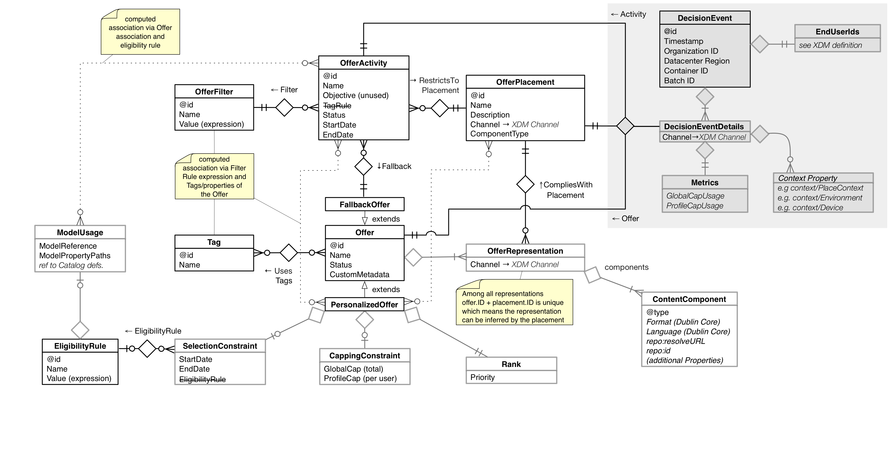

While Content is information that is directed towards an audience for consumption in a (digital) experience, Offer Management is used to personalize this experience by selecting the Next Best Offer and using the attached Content in a place within the experience that is marked as dynamic and filled by an offer.

In Offer Management the goal is to centralize the decisions that lead to those personalizied experiences across various channels. Interactions within one channel can then be analyzed to make decisions on what the next best offer, content or experience would be in a different channel.

Decisioning happens based not only on the offers' constraints and parameters but more importantly based on individual profiles. In addition the decision may be based on which activity the end user associated with a profile engages in. This allows content to be personalized but also adapted to more contextual data.

The main concepts in the domain of Offer Management are:

- Offer this is a data object that references one or several Contents 
  - Offers can be used as the driver of the decisions when personalizing the experience or as a fallback when no qualifying offer can be found.
  - A single Offer can have multiple contents variants. An Offer Representation is the object that connects Offers to Content. Content is information that is directed towards an audience for consumption in a (digital) experience. Content is delivered through channels (or a particular medium). 
  - Offers used for personalization have various entities that serve as control data, each driving a different aspect of the overall decisioning process. For instance Personalization Offers have a Capping Constraint, Selection Constraint and a Rank. 

- Offer Activity this is a data object that represents the invocation of a decisioning process
  - Offer Activities reference an Offer Filter object that is used reduce the offer choices by topic
  - Offer Activities reference an Offer Placement object that is used reduce the offer choices by their ability to fit technically into the overall experience, they also define the actual place in the experience where the winning selection's content will be inserted
  - Offer Activities reference a single Fallback Offer that is used when all other contraints are applied and the resulting list of sutable offers is empty.

